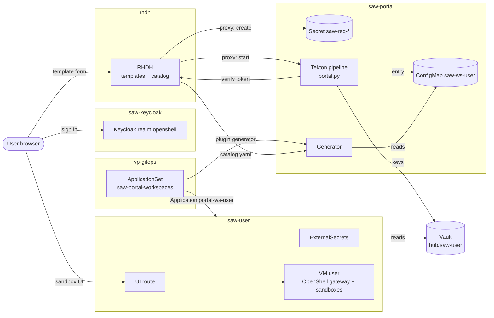
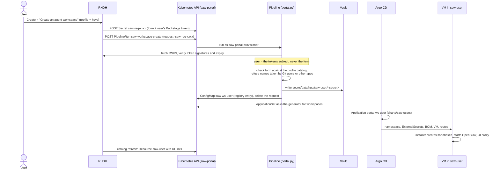
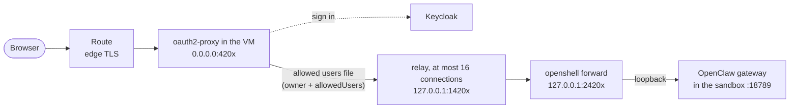

# Self-service workspaces with Red Hat Developer Hub: architecture

Users request their own Secure Agent Workspace (SAW) from Red Hat Developer
Hub (RHDH). They choose a SAW-BOM profile, enter only the API keys that
profile needs, and get a namespace `saw-<user>` with a VM, the profile's
OpenShell sandboxes, and a route to each sandbox web UI that only they can
open. Nothing is written to Git: keys go to Vault, and the workspace is an
entry in an in-cluster registry that Argo CD builds.

This page explains the parts and how they connect. To try it, follow the
[user guide](rhdh-user-guide.md). Settings and design details are in
[self-service-portal.md](self-service-portal.md).

## Components

| Component | Where | What it does |
|---|---|---|
| Red Hat Developer Hub | namespace `rhdh`, `Backstage` CR `developer-hub` (RHDH operator) | The portal. Shows the two templates (create, delete) and one catalog entry per workspace. Users sign in with Keycloak. |
| Keycloak realm `openshell` | namespace `saw-keycloak` | One identity for RHDH, the OpenShell gateway and the sandbox UIs. No self-registration; an admin adds users with generated passwords. Client `rhdh` (confidential) for RHDH, `openshell-dashboard` (public, PKCE) for the web UIs. |
| Request API | RHDH proxy endpoints `/saw-requests`, `/saw-pipelineruns` | The only cluster calls the templates make: create a request Secret, start a pipeline. They use RHDH's service account `rhdh-portal`, which can only *create* those two kinds in `saw-portal`. |
| Portal pipelines | namespace `saw-portal`, Tekton `saw-workspace-create` / `saw-workspace-delete` | Run `portal.py` as service account `saw-portal-provisioner`: verify who the request is for, write the keys to Vault, write or delete the registry entry. |
| Admission policies | `ValidatingAdmissionPolicy` `saw-portal-*` | Pin what `rhdh-portal` may create (Secrets `saw-req-*`, PipelineRuns of the two pipelines with one parameter) and which Argo CD applications the provisioner may delete (`portal-ws-*`, labelled as the portal's). |
| Workspace registry | ConfigMaps `saw-ws-<user>` in `saw-portal` (label `saw.redhat.com/workspace=true`) | One entry per workspace: user name, profile, values for the `saw-users` chart. |
| Generator | Deployment `saw-workspaces-generator` in `saw-portal` | Reads the registry. Serves the Argo CD ApplicationSet plugin API (the list of workspaces) and the RHDH catalog (`/catalog.yaml`). |
| ApplicationSet `saw-portal-workspaces` | Argo CD namespace (`vp-gitops`) | One Application `portal-ws-<user>` per registry entry, rendering `charts/saw-users` for that one user. Creates and updates only; deleting is done by the delete pipeline. |
| `saw-users` → `openshell-saw` | namespace `saw-<user>` | The same charts as a Git-declared user in `overrides/saw-users.yaml`: External Secrets for the user's keys, the BOM, the VM, the gateway and UI routes. |
| Vault | `secret/data/hub/saw-<user>/<secret>` | The user's keys. The provisioner writes them through the `hub` Kubernetes auth mount with role `saw-portal-writer`, whose policy covers only `secret/*/hub/saw-*`. |
| In-VM installer | `apply_bom.py` in the VM | Creates the sandboxes, starts OpenClaw, and runs one OAuth proxy and one port forward per sandbox UI. |
| Cleanup | CronJob `saw-portal-cleanup` | Deletes request Secrets that no pipeline handled. |

## Overview

## Creating a workspace

The VM and its sandboxes take about 10 to 15 minutes after the pipeline
finishes.

Deleting is the mirror image: the template "Delete my agent workspace" runs
`saw-workspace-delete`, which removes the registry entry first (so the
ApplicationSet does not recreate the Application), then deletes Application
`portal-ws-<user>` and, by default, the user's keys in Vault. Argo CD then
deletes the namespace and the VM (`portal.pruneOnRemove`).

## Who a request is for

RHDH's proxy endpoints can be called by any signed-in user, so the pipeline
trusts nothing the form says about the user. The template puts the user's
Backstage token (`secrets.backstageToken`) in the request; the pipeline
verifies it against RHDH's published keys:

- the outer token is a plugin token signed by the scaffolder
  (`/api/scaffolder/.backstage/auth/v1/jwks.json`);
- the user is in its `obo` claim, a limited user token signed by the auth
  backend (`/api/auth/.well-known/jwks.json`).

Both signatures and expiries are checked. The user name is the token's
subject (`user:default/<name>`). A user can therefore create, update or
delete only their own workspace, and a create request cannot run the delete
pipeline. A workspace is refused when its namespace exists without the
portal label (the user is declared in Git), when an Argo CD application it
needs belongs to someone else, or when the name could collide with another
user's applications (`-bom`, `-secrets`).

## Opening a sandbox UI

A sandbox with `ui: {route: true}` in its SAW-BOM profile gets a route
`<user>-<workspace>-<sandbox>-ui.apps.<domain>`. The path from the browser to
OpenClaw:

1. **Keycloak** proves who the user is (their own password).
2. **oauth2-proxy** compares the Keycloak `preferred_username` with the
   allowed users (the workspace owner, plus `sandboxUiProxy.allowedUsers`).
   Anyone else gets 403 here.
3. It forwards the request with that name in `X-Forwarded-Email`,
   overwriting any value the browser sent.
4. A relay lets at most 16 connections at a time through to
   `openshell forward service` and queues the rest: OpenShell refuses more
   than 20 forward connections per sandbox, and a page load opens more.
5. **OpenClaw** runs in trusted-proxy mode: it trusts that header only on
   requests arriving over loopback (where the forward delivers them) and only
   for the same allowed users. A browser device approved this way needs no
   gateway token.

Local clients in the sandbox (the OpenClaw CLI, TUI, `openclaw agent`) use the
gateway secret as `gateway.auth.password`. Sandboxes without a UI route keep
OpenClaw's token mode.

## Users and passwords

- Self-registration is off. An admin adds users from a list
  (`make -f Makefile-quickstart keycloak-add-users`), each with a generated
  24-character password; existing users are left alone.
- The realm enforces a password policy (14+ characters, upper, lower, digit,
  special, not the user name or email, not one of the last 5) and locks an
  account out for a growing time after 5 failed sign-ins.
- The pattern's test users (developer, admin, alice, bob) get generated
  passwords from Vault (`keycloak-users`); there are no default passwords.

## What is in the RHDH catalog

The catalog is configured by the chart; there is nothing to register by hand.

| Location | Kind | Contents |
|---|---|---|
| `/opt/app-root/src/saw/create-workspace.yaml` (ConfigMap `saw-rhdh-templates`) | Template | "Create an agent workspace" |
| `/opt/app-root/src/saw/delete-workspace.yaml` | Template | "Delete my agent workspace" |
| `http://saw-workspaces-generator.saw-portal.svc:4355/catalog.yaml` | Resource | One `saw-<user>` per workspace, type `agent-workspace`, owned by `user:default/<user>`, with links to the OpenShell web UI, each sandbox UI and the delete template |

RHDH reads these locations every 30 seconds (`rhdh.catalogProcessingSeconds`).
The create form is generated from the SAW-BOM profiles by
`scripts/saw-profile-catalog.py`, so it asks only for the keys the chosen
profile needs.

## Names

| Thing | Name |
|---|---|
| Namespace | `saw-<user>` (label `saw.redhat.com/portal=true`) |
| VM | `<user>` |
| Argo CD applications | `portal-ws-<user>` → `saw-<user>-secrets`, `saw-<user>-bom`, `saw-<user>` |
| Registry entry | ConfigMap `saw-ws-<user>` in `saw-portal` |
| Keys | `secret/data/hub/saw-<user>/<secret>` (e.g. `inference`, `web-search`) |
| OpenShell web UI | `https://<user>-webui-saw-<user>.apps.<domain>` |
| Sandbox UI | `https://<user>-<workspace>-<sandbox>-ui.apps.<domain>` |
| RHDH | `https://backstage-developer-hub-rhdh.apps.<domain>` |

User names are lowercase DNS labels of at most 19 characters (they name the
VM).

## Status

Checked on a live cluster (OpenShift with RHDH operator 1.10, OpenClaw
2026.9.5):

- the Keycloak changes: policy, lockout, registration off, generated
  passwords, adding and resetting users;
- the sandbox UI: the Keycloak sign-in through the route, the owner admitted
  and another user refused by oauth2-proxy;
- the RHDH `Backstage` resource against the operator's `v1alpha4` and
  `v1alpha5` schemas;
- the installer across VM restarts.

Still to confirm on a cluster: OpenClaw accepting the owner from
`X-Forwarded-Email` without a token and the CLI password, and the full
request flow from the RHDH form to a running workspace (token shapes on the
installed RHDH, OpenShift Pipelines' defaults against the admission policy,
the ApplicationSet controller in the pattern's Argo CD). The
[user guide](rhdh-user-guide.md) walks through each of these checks.
